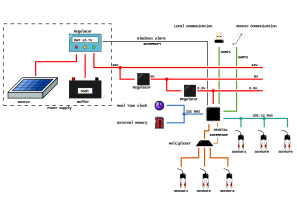

# From-Sensor-To-Graph

**readme under development, but please go ahead** :smile:

Open educational resources (OER) for the development of an environmental data acquisition systems — a hardware/software hybrid.

The aim of this project is to provide knowledge in hardware and software development using the example of an environmental data acquisition system with a very wide scope. Interested individuals and institutions are invited to contribute!

## General thoughts

Environmental data are getting more and more in the focus of society as they allow us to assess if, and how, we influence our direct and indirect surroundings and possible feedbacks. Depending on the area of interest, the type of data can vary strongly, e.g. noise level and air quality for concentrated urban environments, or precipitation and soil moisture for wide-spread rural environments.

A comprehensive analysis relies heavily on an adequat spatio-temporal distribution of data sources in order to describe how patterns develop and vary over space and time. In order to address this, the target of this OER project is a sophisticated environmental data acquisition system.

## What makes this project different from others?

There are plenty of projects out there that work on similar things like weather stations. For all of which I have seen, the aim is to have a running system that measures the wished quantities.

However, having such a system deployed in the field, without WiFi, Bluetooth or cable, and no access to the power grid, is a very different issue. Also, such projects do not focus on the system maintenance and the importance of data integrity regarding the data analysis. What happens, when you exchange a defect sensor or you observe changes in your local environment (a new building next to wind speed measurement, or recent clear-cutting of your forest). A sophisticated system needs to be able to incorporate these information into the data in order to acount for that during the analysis.

In short: the dedicated focus on data quality and integrity, deployed system maintenance, and the complete chain from the sensor until the graph, make this project different.

## Scope of project

* **Field system:** Arduino Mega; power supply (photovoltaics), buffering (battery) and management; local data storage (RAM and SD card); time keeping (real-time clock); sensor interfaces (digital, analog, protocol); interrupts; maintenance interface;
* **Remote transmission:** mobile phone network (or LoRaWAN); login at server; encrypted data transmission; over-the-air-programming;
* **Server system:** Raspberry Pi3; dynDNS; station management; data base; running scripts for pre-processing; providing data via credentials;

## Overview for field system

